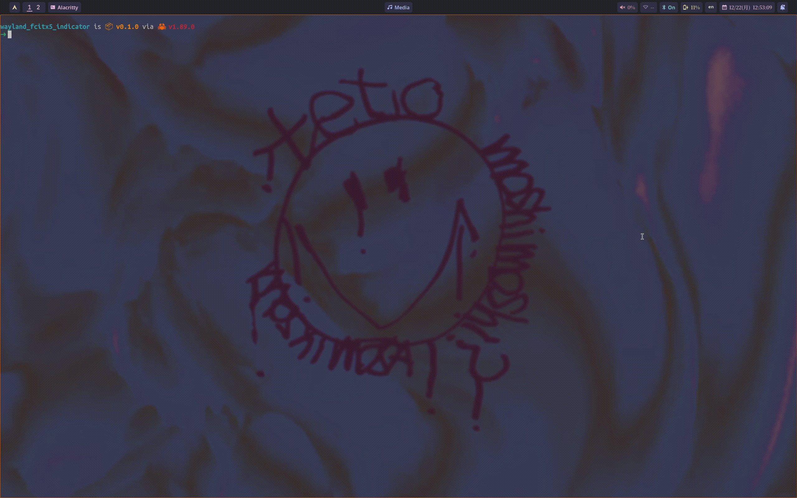

# wayland_fcitx5_indicator

Fcitx5の入力モードが変更された際に、現在アクティブなウィンドウの中央にインジケ-ションを表示するシンプルなデーモンです。



## ✨ 機能

- **Fcitx5連携**: DBus経由でFcitx5の入力モード変更を監視します。
- **Waylandネイティブ**: Wayland (wlr-layer-shell) 上で動作します。
- **Hyprland連携**: アクティブなウィンドウの中央にインジケーターを表示します。
- **軽量**: 依存関係を最小限に抑え、効率的に動作します。
- **フェードアウト**: インジケーターは表示後、スムーズにフェードアウトします。

## ⚙️ 要件

- Waylandコンポジタ (Hyprland推奨)
- Fcitx5
- Rust / Cargo

## 📦 インストールと実行

1.  リポジトリをクローンします:
    ```bash
    git clone https://github.com/your-username/wayland_fcitx5_indicator.git
    cd wayland_fcitx5_indicator
    ```

2.  リリースモードでビルドします:
    ```bash
    cargo build --release
    ```

3.  実行可能ファイルをパスの通ったディレクトリにコピーします:
    ```bash
    cp target/release/wayland_fcitx5_indicator ~/.local/bin/
    ```

4.  Hyprlandの設定ファイル (`hyprland.conf`) などで、自動起動するように設定します:
    ```
    exec-once = wayland_fcitx5_indicator
    ```

## 🔧 設定

設定はプロジェクトルートにある `config.ron`([Rusty Object Notation](https://github.com/ron-rs/ron)) ファイルで管理されています。このファイルには、Fcitx5の入力メソッド名と表示テキストのマッピング、オーバーレイ表示のサイズやフォントサイズ、アニメーションに関する設定が含まれています。

`config.ron` の内容を直接編集することで、インジケーターの挙動をカスタマイズできます。

例えば、以下のように設定を調整できます:

```ron
(
    input_method_names: {
        "mozc-jp": "あ",
        "keyboard-us": "A",
        // 他の入力メソッドに対するマッピングを追加
    },
    overlay: (
        width: 150,
        height: 150,
        font_size: 70.0,
        font_family: "IPAゴシック",
    ),
    animation: (
        display_duration_ms: 800,
        fade_duration_ms: 200,
        fade_frames: 20,
    ),
)
```

設定構造の詳細については、`src/config.rs` を参照してください。
